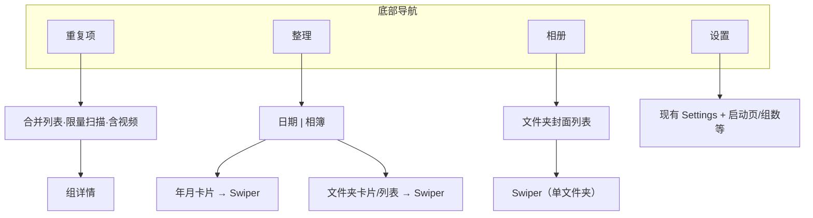

# CleanSweep UI 重构设计文档

<!-- AI / Grok NOTE: If user requires git commits, MUST use Conventional Commits. See AGENTS.md + CONTRIBUTING.md. -->

**版本：** v0.4（功能 v0.3 + 视觉 v0.4）  
**状态：** 已确认，待实现  
**关联文档：** [`cleaning-app-architecture.md`](cleaning-app-architecture.md)、[`swiper-card-stack.md`](swiper-card-stack.md)

本文档汇总 UI 重构的完整需求，供新对话/开发者直接按阶段实现，无需回溯讨论记录。

---

## 1. 目标

将当前以 `SessionSetupScreen` 为首页的单层导航，重构为 **底部四栏主导航**。核心整理能力（`SwiperScreen`、删除池、重复项详情）**复用不重写**，主要改导航壳层与入口组织。

---

## 2. 底部导航

| Tab | 标签 | 图标 | 职责 |
|-----|------|------|------|
| 1 | **重复项** | 叠放照片形态（Material 风格） | 重复/相似组列表 |
| 2 | **整理** | 手势/点选图标 | 按日期或相册选择整理范围 |
| 3 | **相册** | 图集/相册图标 | 文件夹浏览，点进整理 |
| 4 | **设置** | 齿轮（现有） | 全部设置与说明 |

### 导航规则

- **冷启动默认 Tab：整理**（可在设置中配置启动页）
- 进入 `SwiperScreen`、`GroupDetailsScreen`、设置子页等全屏流程时：**隐藏**底部栏，TopAppBar 返回
- 从子页返回：回到对应 Tab 根页面

### 与参考 App 对照

参考图（ByePhotos 等）仅用于 **信息架构、Tab 划分、布局逻辑、底部图标形态**。

| 参考 App | CleanSweep |
|----------|------------|
| 相似 | **重复项** |
| 整理 | **整理** |
| 压缩 | **不做** |
| 设置 | **设置** |
| — | **新增相册 Tab** |

---

## 3. 视觉与主题规范（v0.4）

**不沿用**参考 App 的深色背景、橙色强调、氛围背景等视觉语言。新 UI 与现有 `SessionSetupScreen`、`SettingsScreen` 等同源。

### 3.1 主题（复用现有，不新建）

| 能力 | 实现 | 默认值 |
|------|------|--------|
| 浅色/深色 | `AppTheme`（`LIGHT` / `DARK` / `SYSTEM` / `DARKER` / `AMOLED`） | `SYSTEM` |
| 强调色 | `predefinedAccentColors` + `accentColorKey` | `DEFAULT_BLUE` |

设置 Tab 迁移现有主题与强调色选择器即可，**无需新增存储键**。

### 3.2 颜色 Token（禁止硬编码参考图色值）

```kotlin
MaterialTheme.colorScheme.primary          // 强调色、进度条、选中态
MaterialTheme.colorScheme.primaryContainer // 选中卡片背景
MaterialTheme.colorScheme.surface          // 页面/卡片底
MaterialTheme.colorScheme.surfaceVariant   // 次级卡片（与 SessionSetup 一致）
MaterialTheme.colorScheme.onSurface        // 主文字
MaterialTheme.colorScheme.onSurfaceVariant // 数量、说明文字
```

### 3.3 组件风格

| 组件 | 规范 |
|------|------|
| 卡片 | 现有 `Card`：`surfaceVariant`、标准圆角 |
| 底部导航 | Material3 `NavigationBar`，选中态用 `primary` / `primaryContainer` |
| 日期/相簿切换 | `SingleChoiceSegmentedButtonRow` |
| 列表行 | 与 `SessionSetupScreen` 文件夹行一致 |
| TopAppBar | `surfaceColorAtElevation(3.dp)` |
| 对话框/下拉 | `AppDialog`、`AppDropdownMenu` |
| 页边距 | 16dp；卡片间距 8–12dp |

### 3.4 进度条

整理·相簿文件夹卡片、整理 Tab 顶部全局进度条（若有）统一：

```kotlin
LinearProgressIndicator(
    color = MaterialTheme.colorScheme.primary,
    trackColor = MaterialTheme.colorScheme.surfaceVariant,
)
```

用户切换强调色后进度条同步变化。无进度数据时隐藏，不占位。

### 3.5 参考图采纳/不采纳

| 采纳 | 不采纳 |
|------|--------|
| 四 Tab 结构与图标形态 | 深色+橙色配色 |
| 整理 日期/相簿 Segmented | 模糊氛围背景 |
| 重复项组列表+缩略图网格 | 圆形月份徽章（v1 用图片卡片） |
| 文件夹/月份卡片布局 | 底部栏胶囊高亮（用 Material3 默认） |

---

## 4. Tab 详细设计

### 4.1 重复项

#### 功能

- **精确重复与相似项合并**为同一列表，不按类型分区
- 扫描范围含 **图片 + 视频**
- 进入 Tab / 进入 App 时触发扫描刷新
- 扫描 **只需达到展示组数即可提前结束**；选「展示全部」时执行完整扫描
- 排序：**组内最新文件时间**降序（`max(DATE_TAKEN ?? lastModified)`）

#### 顶部

- 标题旁下拉：展示组数 **10 / 20 / 30 / 40 / 50 / 全部**（会话级覆盖）
- 统计行：组数 + 可释放空间/总大小

#### 组列表

- 每组：「N 张照片/视频」+ 缩略图网格预览
- 点击组 → `GroupDetailsScreen`（复用）

#### 设置项

| 键 | 说明 | 默认 |
|----|------|------|
| `duplicate_display_group_count` | 默认展示组数 | 20 |

#### 改造点

- `DuplicateScanService`：支持 `maxGroups`、含视频、可提前结束
- `DuplicatesScreen` / `DuplicatesViewModel`：合并展示、限量扫描、排序逻辑
- `PreferencesRepository`：持久化默认组数

---

### 4.2 整理

顶部 **日期 | 相簿** SegmentedControl。右上角菜单：**图片展示 ↔ 列表展示**（偏好持久化）。

媒体范围：**图片 + 视频**。

#### 4.2.1 日期子页

**默认：图片卡片模式**

```text
2026年
  [封面=该月最新媒体]  [封面]  [封面]
  6月 / 451           5月 / 466  ...
```

| 规则 | 说明 |
|------|------|
| Group | 年份标题（`2026年`） |
| Item | 月份卡片；封面 = 该月最新图片/视频 |
| 时间字段 | `DATE_TAKEN` 优先，否则 `lastModified` |
| 排序 | 年降序，月降序 |
| 点击 | → `SwiperScreen`（该月全部媒体，时间降序） |

**列表模式**：紧凑行 + 年份 sticky header。

#### 4.2.2 相簿子页

**默认：图片卡片模式**（封面 = 文件夹内最新媒体）

| 规则 | 说明 |
|------|------|
| 多选 | 保留长按多选 → 多文件夹进入 Swiper |
| 搜索/排序 | 保留现有 `SessionSetup` 能力 |
| 进度条 | 可选「已整理进度」，颜色用 `primary` |
| 点击 | → `SwiperScreen`（`bucketIds`） |

**列表模式**：双列/单列紧凑行（名称 + 数量 + 可选进度条）。

#### 与 SessionSetup 的关系

- 文件夹数据、多选、收藏、标记已整理、重命名等 **迁入整理·相簿**
- `SessionSetupScreen` 不再作为 App 首页
- 各页顶栏「去设置/去重复项」**移除**（由底部栏承担）

#### 顶部统计（可选，P2+）

百分比 + 进度条 +「已查看 x/总数」；类型筛选图标行可后续迭代。

---

### 4.3 相册

> **注意：** 早期草案「全量扁平时间线」已作废。

- 进入即展示 **所有文件夹**
- 每文件夹一张卡片：**最新一张图/视频** 作封面 + 名称 + 数量
- **点击文件夹** → `SwiperScreen`，仅加载该文件夹
- **不支持**多选、日期分组、进度/标记（与整理·相簿区分）

| 维度 | 整理·相簿 | 相册 Tab |
|------|-----------|----------|
| 目的 | 选范围、批量整理 | 快速浏览、单文件夹进入 |
| 日期维度 | 有 | 无 |
| 多选 | 支持 | 不支持 |
| 进度/标记 | 有 | 无 |

---

### 4.4 设置

第四 Tab **即设置根页面**（原「更多」取消）。

迁移现有 `SettingsScreen` 全部条目，并增补：

```text
外观
├── 应用主题（现有 AppTheme）
├── 强调色（现有色板，默认 DEFAULT_BLUE）
整理
├── 默认视图模式（图片/列表）
重复项
├── 默认展示组数（10/20/30/40/50）
启动
├── 应用启动页（整理 / 重复项 / 相册 / 设置）
关于
└── 开源许可 → OpenSourceLicensesScreen
```

子页仍用 TopAppBar 返回，隐藏底部栏。

---

## 5. 信息架构



---

## 6. 核心用户路径

```text
A. 默认启动     App → 整理 Tab
B. 按月份整理   整理 → 日期 → 点某月 → Swiper → 返回
C. 按文件夹整理 整理 → 相簿 → 多选文件夹 → Swiper → 返回
D. 相册快整理   相册 → 点文件夹 → Swiper → 返回
E. 重复项       重复项 → 限量扫描 → 点组 → 详情 → 返回
F. 设置         设置 Tab → 配置 / 子页
```

---

## 7. 与现有代码映射

| 新模块 | 策略 |
|--------|------|
| 底部导航壳层 | 新增 `MainShell` + 扩展 `AppNavigation` |
| 整理·相簿 | 重构 `SessionSetupScreen`，拆展示层 |
| 整理·日期 | 新增 `OrganizeByDateScreen` + ViewModel |
| 相册 Tab | 新增 `GalleryScreen` + ViewModel |
| 重复项 Tab | 精简 `DuplicatesScreen`，限量扫描 |
| 设置 Tab | 挂载 `SettingsScreen`，清理旧入口 |
| Swiper 入口 | 扩展路由：除 `bucketIds` 外支持按月、`startIndex` 等 |
| 共用组件 | `MediaGroupCardGrid`、`MediaGroupList`、`OrganizeViewModeToggle` |

### 必须遵守的现有约束

- 竖屏锁定 + `WindowSizeClass` 区分手机/展开布局（见 `cleaning-app-architecture.md` §2.4）
- Organize 手势、删除池、预览性能策略不变
- MVVM + 子 Composable **不接收完整 UiState**（见 `CONTRIBUTING.md`）
- Kotlin 改动提交前运行 `./gradlew :app:compileDebugKotlin`

---

## 8. 已决议项（完整清单）

| # | 决议 |
|---|------|
| 1 | 冷启动默认 Tab = **整理** |
| 2 | 相册 Tab = 文件夹列表 + 最新封面，点击进入该文件夹 Swiper |
| 3 | 重复项：精确 + 相似 **合并** |
| 4 | 全局媒体：**含视频** |
| 5 | 第四 Tab = **设置**（非「更多」） |
| 6 | 底部图标形态参考图，**颜色走现有主题** |
| 7 | 重复项排序 = 组内最新文件时间 |
| 8 | 重复项扫描 = 扫到展示组数即可停止 |
| 9 | 整理日期/相簿默认 = 图片卡片，可切列表 |
| 10 | 视觉保持 CleanSweep 简约 Material3，**不抄参考图配色** |
| 11 | 深/浅色、强调色 = **复用现有** `AppTheme` + `accentColorKey` |
| 12 | 进度条颜色 = `MaterialTheme.colorScheme.primary` |

---

## 9. 可选迭代（不阻塞 P1）

1. 整理 Tab 顶部「已查看 x/总数」进度统计 — P2+
2. 重复项组卡片：2×2 预览格 vs 横向滚动缩略图 — 实现时按简约风格择一
3. 整理 Tab 顶部媒体类型筛选图标行 — P2+

---

## 10. 实施顺序

| 阶段 | 内容 |
|------|------|
| **P1** | 底部四 Tab 壳层 + 路由重构；默认整理；设置 Tab 挂载现有 Settings |
| **P2** | 整理 Tab：日期/相簿 Segmented + 图片卡片 + 列表切换 + 共用组件 |
| **P3** | 相册 Tab：文件夹封面列表 → Swiper |
| **P4** | 重复项 Tab：合并展示 + 限量扫描 + 组数下拉 + 含视频 |
| **P5** | 设置增补（启动页、组数默认值等）；清理各页旧设置入口 |
| **P6** | 展开屏适配、顶部进度/筛选、视觉微调 |

**新对话建议指令：**

```text
请阅读 docs/ui-refactor-design.md，从 P1 开始实现 UI 重构。
遵守 AGENTS.md 与 CONTRIBUTING.md；Android 改动后运行 ./gradlew :app:compileDebugKotlin。
```

---

## 11. 版本历史

| 版本 | 变更 |
|------|------|
| v0.1 | 初稿：四 Tab、整理双维度、相册时间线草案 |
| v0.2 | 重复项限量扫描；整理图片/列表切换；图集卡片布局 |
| v0.3 | 默认整理；相册改为文件夹列表；合并重复项；含视频；设置 Tab |
| v0.4 | 视觉沿用现有主题；进度条用 primary；参考图仅 IA/布局 |